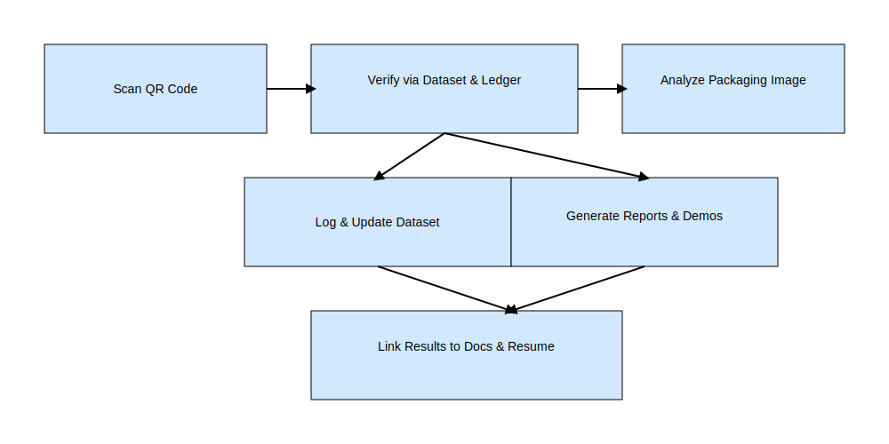

# SanFortis‑RxAuth

SanFortis‑RxAuth is an open‑source proof‑of‑concept aimed at combating counterfeit and substandard medicines.  It shows how pharmacists, clinicians and consumers could verify the authenticity of medicines by scanning QR codes on packaging, analysing simple packaging details and comparing cryptographic hashes !)
stored in a tamper‑evident ledger.
[
## Features

- 📱 **Simple verification script** – demonstrate how a serial number, manufacturer and expiry date can be hashed and compared against an expected value.
- 🔐 **Cryptographic hashing** – detects tampering of known serial numbers and packaging details using SHA‑256.
- 🗃️ **Sample dataset** – includes a small set of example medicines with pre‑computed hashes in `data/medications.json`.
- 🧩 **Extensible architecture** – designed to be expanded with QR code decoding, packaging image analysis or integration with a real pharmaceutical ledger.

## Getting started

These instructions describe how to run the demonstration script locally.  You will need Python 3.8+.

```bash
git clone https://github.com/USERNAME/SanFortis-RxAuth.git
cd SanFortis-RxAuth
python3 -m venv env
source env/bin/activate
pip install -r requirements.txt  # optional, if you add dependencies
python src/verify_medicine.py --help
```

To verify a sample medicine:

```bash
python src/verify_medicine.py \
  --serial HC12345 \
  --manufacturer HealthCorp \
  --expiry 2026-12-31
```

The script will report whether the provided details match the expected hash in the sample dataset.

## How it works

1. The project stores a list of known medicines in `data/medications.json`.  Each entry contains a name, manufacturer, serial number, expiry date and the SHA‑256 hash of those three pieces of information concatenated together.
2. The CLI script accepts the serial number, manufacturer and expiry date as input, computes a SHA‑256 hash from them and then looks up the serial number in the dataset.
3. If the computed hash matches the stored hash, the medicine is considered authentic.  If it does not match, the medicine is flagged as potentially counterfeit.

This basic mechanism mimics how a supply‑chain ledger might be used to verify medicine authenticity.  In a real deployment the hashes would be stored in a secure, immutable database or blockchain and there would be additional checks such as packaging image analysis.

## Project structure

```
sanfortis-rxauth/
├── README.md            # You are here
├── LICENSE              # GNU GPL‑3.0 license (open source)
├── .gitignore           # Ignore Python artefacts and virtual environments
├── data/
│   └── medications.json # Sample dataset of medicines with hashes
├── src/
│   └── verify_medicine.py  # Command‑line script for verifying medicines
├── docs/
│   └── roadmap.md      # Planned enhancements and milestones
└── requirements.txt    # (optional) dependencies if you add QR decoding etc.
```

## Disclaimer

SanFortis‑RxAuth is a **proof of concept** for educational purposes only.  It is not a certified medical or regulatory tool.  Do not rely on it to make healthcare decisions.  For production systems, consult pharmaceutical authorities and comply with all legal and regulatory requirements.
